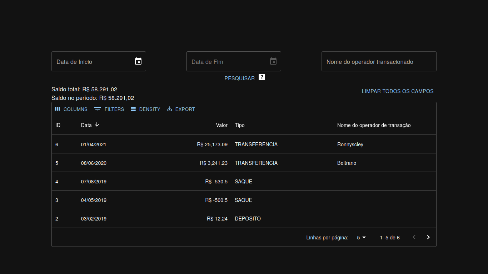

	

# Processo Seletivo SUPERA
**Frontend em React de transferência de banco [Repo. da API RESTFul em Java](https://github.com/renatonunes74/PS_SUPERA_Backend)**

[Como usar](#como-usar) -
[Funcionalidades](#funcionalidades) -
[Dependências necessárias](#dependências-necessárias) -
[Tecnologias usadas](#tecnologias-usadas)
 

## Pré-visualização

## Como usar
1. Clone o repositório
    - `git clone https://github.com/renatonunes74/PS_SUPERA_Frontend`
1. Entre na pasta
    - `cd PS_SUPERA_Frontend/banco`
1. Rode localmente
    - CLI / via Terminal:
        1. `npm install`
        1. `npm run start`
    - Via IDE (Vscode...)
1. Agora é só fazer as requisições para a API
    - **OBS**: necessário estar com a [API RESTFul em Java](https://github.com/renatonunes74/PS_SUPERA_Backend) rodando localmente

### Funcionalidades
- [x] Filtro por período de datas
- [x] Filtro por período de datas e operador de transação
- [x] Filtro por nome do operador de transação
- [x] Saldo total no geral
- [x] Saldo total por período
- [x] Limpeza dos campos

### Dependências necessárias
- [NodeJS](https://nodejs.org)

### Tecnologias usadas
- Frameworks: [React](https://react.dev/), [TypeScript](https://www.typescriptlang.org/)
- Bibliotecas:
    - [Axios](https://axios-http.com/) (Integração para consumir a API)
    - [Material UI](https://mui.com/) (Ferramentas de interface para o React UI)
    - [Day.js](https://day.js.org/) (Analisa, valida, manipula e exibe datas e horas)
